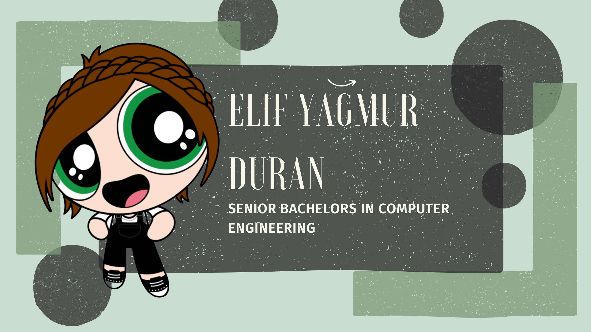

<h1 align="center" height='500px'> welcome ☄️ </h1>

### hi! welcome to my github page. 🧙‍♀️

  

### about me 🌙

my name is yağmur. i am a master student in software engineering looking for opportunities to advance in my career. i am also a video essay youtuber.

## my education 🔮

master's in software engineering | [free university of bozen bolzano](https://www.unibz.it/en/faculties/engineering/master-software-engineering/)

bachelor's in computer engineering | [yıldız technical university](http://www.bologna.yildiz.edu.tr/index.php?r=program/view&id=196&aid=3)

## currently working on... 🔭

    🐈 my master's degree and software engineering skills

    🐈 an android calculator app with java, to demonstrate how tdd techniques work
    
    🐈 an opendatahub api project - coming soon

    🐈 video essays for my youtube channel

## you can find me here... 🕯️

[![LinkedIn][linkedin-shield]][linkedin-url]
[![Gmail][gmail-shield]][gmail-url]
[![youtube][youtube-shield]][youtube-url]
[![twitter][twitter-shield]][twitter-url]

[linkedin-shield]: https://img.shields.io/badge/linkedin-%230077B5.svg?style=for-the-badge&logo=linkedin&logoColor=white
[linkedin-url]: https://www.linkedin.com/in/ya%C4%9Fmur-duran-645510182/
[twitter-shield]: https://img.shields.io/badge/twitter-%231DA1F2.svg?style=for-the-badge&logo=Twitter&logoColor=white
[twitter-url]: https://www.linkedin.com/in/ya%C4%9Fmur-duran-645510182/
[youtube-shield]: https://img.shields.io/badge/YouTube-%23FF0000.svg?style=for-the-badge&logo=YouTube&logoColor=white
[youtube-url]: https://www.youtube.com/@CaptainRainofthe7Seas
[gmail-shield]: https://img.shields.io/badge/Gmail-D14836?style=for-the-badge&logo=gmail&logoColor=white
[gmail-url]: mailto:elifyagmurduran@gmail.com?
